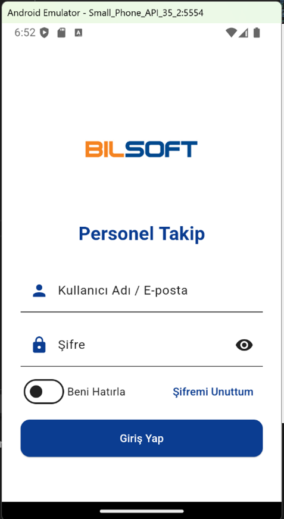
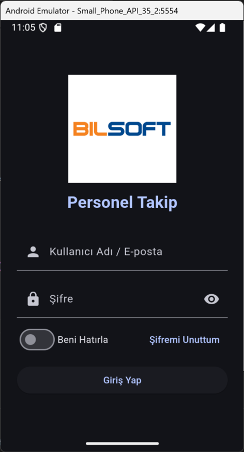
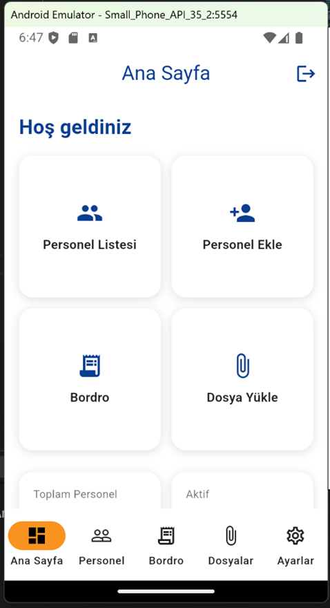
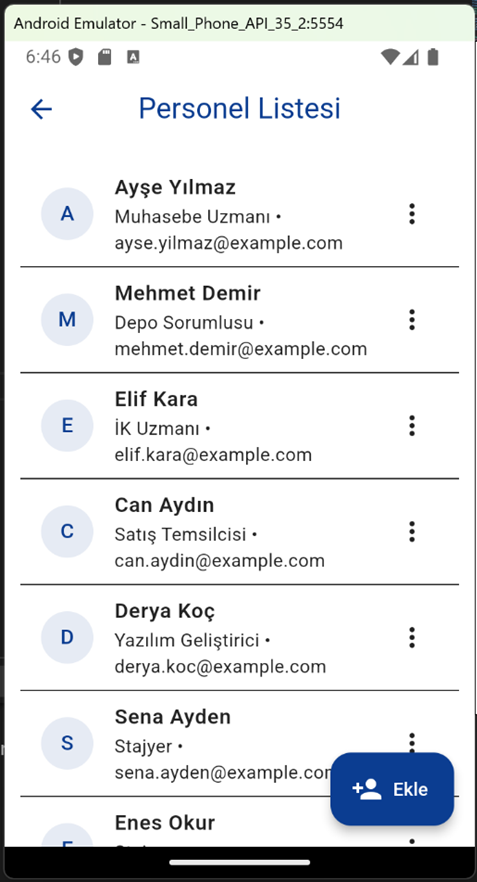
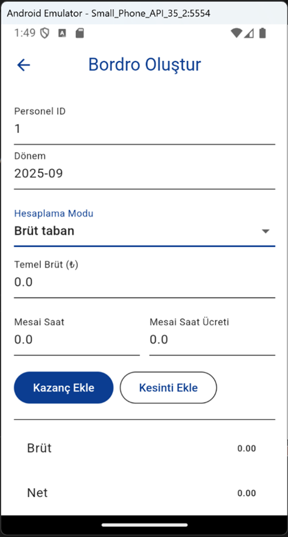
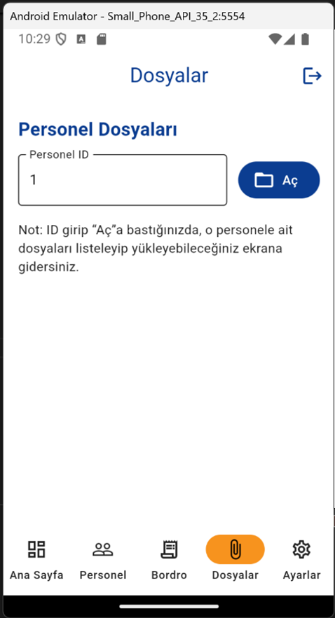
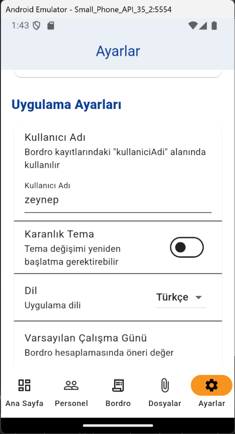

# Personnel Tracking System (Flutter)

This project was developed during my internship at **Bilsoft Yazılım** and deployed to production.

It is a production-ready mobile Personnel Tracking System built with **Flutter** and integrated with secure **REST APIs**.

---

## Features

- JWT-based authentication
- Personnel CRUD operations
- Payroll management module
- File upload & attachment handling
- Secure token storage
- Modular MVVM-based architecture
- App-wide Dark Mode support
- Multi-language support

---

## Technologies Used

- Flutter
- Dart
- REST API integration
- Secure token storage
- MVVM Architecture

---

## Deployment

The application was internally approved and deployed to production during my internship period.

> This repository does not contain real user data. A test database is used.

---

## Application Screens

### Authentication (Light / Dark Mode)

  
  

### Dashboard

  

### Personnel Management

  

### Payroll Module

  

### File Management

  

### Settings

  

